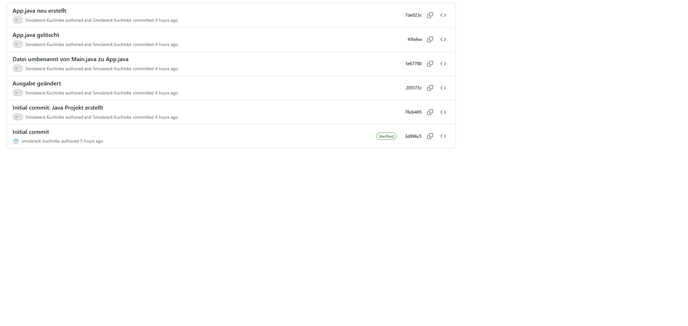
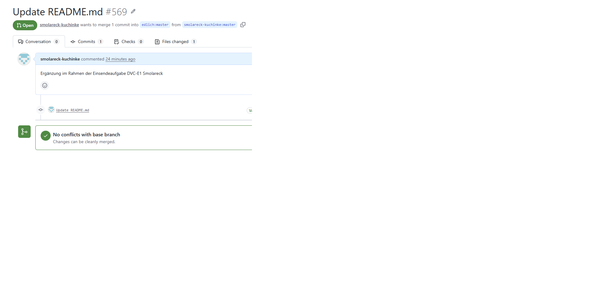

# softwaretechnik-dvc

# Einsendeaufgabe Versionskontrolle: DVC-E1: Versionsverwaltung mit Git

## Repository

https://github.com/smolareck-kuchinke/softwaretechnik-dvc

---

## 1. Repository erstellt

* GitHub-Repository habe ich erstellt und wie gefordert auf public gesetzt.

---

## 2. Projekt hochgeladen

* Ein kleines Java-Projekt (`Main.java` / später `App.java`) erstellt und hochgeladen. Initialer Commit durchgeführt.

---

## 3. Git-Befehle angewendet

>Folgende sind im Repository nachvollziehbar:

* `git status`
* `git add`
* `git commit`
* `git push`
* `git pull`
* `git diff`
* `git mv`
* `git rm`

---

## 4. Zeitreisen (History)

* Über "git diff" habe ich Änderungen zwischen Versionen sichtbar gemacht. Commits dokumentieren die Entwicklungsschritte.

---

## 5. Branches und Merge

* Zwei Branches erstellt:

  * "feature1"
  * "feature2"
* Änderungen in beiden Branches durchgeführt
* Anschließend wieder in den `main`-Branch gemerged

---

## 6. Erfolgreicher Pull Request

https://github.com/edlich/education/pull/569

---

## Screenshots

### Git-Verlauf

### Branches

### Pull Request

